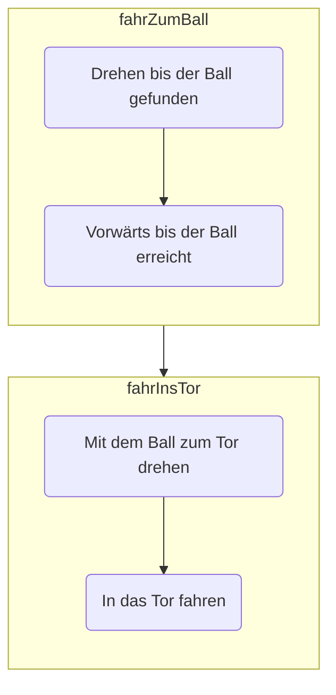

# robot

Das Repository der Wangener Soccer Gruppe des SFZ.

## Programm

```mermaid
flowchart TB
    subgraph fahrZumBall
        direction TB
        d1(Drehen bis der Ball gefunden)
        d2(Vorwärts bis der Ball erreicht)
        d1 --> d2
    end
    subgraph fahrInsTor
        direction TB
        d3(Mit dem Ball zum Tor drehen)
        d4(In das Tor fahren)
        d3 --> d4
    end
    fahrZumBall --> fahrInsTor
```
